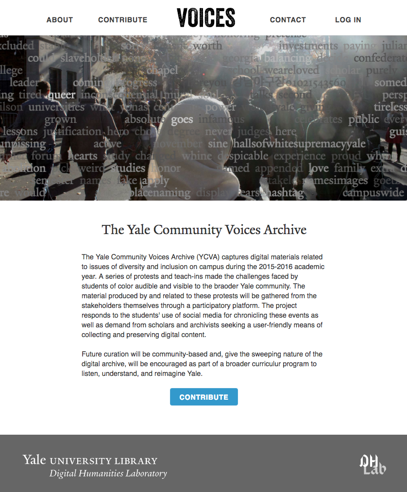

## Introduction

[Voices](http://voices.library.yale.edu/) is an application designed to help collect materials related to student activism on the Yale campus. Site visitors from the Yale community can use the site to contribute images, videos, and other documents with which an archive of activism materials can be assembled. 



The installation and configuration notes below are meant to help team members work with the source code in this repository. If you'd like to contribute, we'd love to hear from you!

## Development Overview

#### Install OS Dependencies

This application depends on PostgreSQL for its db, ImageMagick for image processing, FFMPEG for video processing, and Ghostscript for PDF processing. On OSX, you can install these dependencies with homebrew:

```
brew install postgresql ffmpeg ghostscript
brew unlink imagemagick
brew install imagemagick@6
brew link imagemagick@6 --force
```

#### Clone source code

To clone the source code to your local machine and install required modules, you can run the following lines:
```
git clone https://github.com/YaleDHLab/voices.git
cd voices
gem install bundler
gem install puma -v 2.13.4 -- --with-opt-dir=/usr/local/opt/openssl
bundle install
```

#### Configure administrators

After installing the dependencies above, identify the site admins in an environment variable

```
# The CAS usernames of all site admins, joined by #
VOICES_ADMINS="admin_cas_name_1#admin_cas_name_2#admin_cas_name_3"
```

#### Configure mailer

To enable the site to send emails, store the following environment variables:

```
# GMAIL_USERNAME a gmail address to which emails will be sent  
GMAIL_USERNAME="SAMPLE_GMAIL_ADDRESS@gmail.com"  
  
# GMAIL_PASSWORD the password for the GMAIL_USERNAME account  
GMAIL_PASSWORD="SAMPLE_GMAIL_ADDRESS_PASSWORD"  
```

After setting those variables, you need to [allow GMAIL to send emails from the specified address](https://www.google.com/settings/security/lesssecureapps).

#### Set secret key

You'll also need to set a secret token for the application (you can do so by running `rake secret` on the command line) and store that secret in an environment variable:

```
VOICES_SECRET_KEY="YOUR_SECRET_KEY_HERE"
```

#### Configure AWS S3 Bucket Storage

In order to avoid making assumptions about the available disk space on the deployment server, this application stores user-contributed assets on Amazon Web Services's S3 infrastructure. To allow the application to upload assets to a S3 bucket, you'll need an AWS account and an S3 bucket. 

After creating a bucket, you'll need to create a `bucket policy` for the bucket. The following is sufficient for the purposes of this application:

```
{
	"Version": "2012-10-17",
	"Statement": [
		{
			"Sid": "uploadFile",
			"Effect": "Allow",
			"Principal": "*",
			"Action": [
				"s3:PutObject",
				"s3:GetObject"
			],
			"Resource": "arn:aws:s3:::YOUR_BUCKET_NAME/*"
		},
		{
			"Sid": "crossdomainAccess",
			"Effect": "Allow",
			"Principal": "*",
			"Action": "s3:GetObject",
			"Resource": "arn:aws:s3:::YOUR_BUCKET_NAME/crossdomain.xml"
		}
	]
}
```

To support non-HTML5 browsers, you should create a file named `crossdomain.xml` in the root of your S3 bucket with the following content:

```
<cross-domain-policy>
  <site-control permitted-cross-domain-policies="all"/>
  <allow-access-from domain="YOUR_APPLICATION_URL"/>
  <allow-http-request-headers-from domain="*" headers="*" secure="false"/>
</cross-domain-policy>
```

You'll also need to set a CORS configuration for the bucket. The following is sufficient for the purposes of this application:

```
<?xml version="1.0" encoding="UTF-8"?>
<CORSConfiguration xmlns="http://s3.amazonaws.com/doc/2006-03-01/">
    <CORSRule>
        <AllowedOrigin>*</AllowedOrigin>
        <AllowedMethod>GET</AllowedMethod>
        <AllowedMethod>PUT</AllowedMethod>
        <AllowedMethod>POST</AllowedMethod>
        <AllowedMethod>DELETE</AllowedMethod>
        <AllowedHeader>*</AllowedHeader>
    </CORSRule>
</CORSConfiguration>
```

After creating and configuring the bucket, you'll need to allow the application to make HTTP requests to alter bucket content. There are two methods through which the application interacts with materials in the bucket: through server-side interactions (for video files, which are processed with ffmpeg on the server), and through client-side interactions (for other file types, which are sent to S3 from the client to reduce server strain). 

You can grant the server-side components of the app access to the bucket by setting the following environment variables:

```
# The name of your bucket in AWS
AWS_S3_BUCKET_NAME='YOUR_BUCKET_NAME'

# Your AWS Access Key Id
AWS_ACCESS_KEY_ID='YOUR_AWS_ACCESS_KEY_ID'

# Your AWS Secret Access Key
AWS_SECRET_ACCESS_KEY='YOUR_AWS_SECRET_ACCCESS_KEY'

# Your AWS Region
AWS_REGION='us-west-2'
```

You can grant client-side components of the application access to the bucket by first updating the bucket name identified in `voices/lib/tasks/aws_bucket_policy.json` (and optionally setting additional [options](http://aws.amazon.com/articles/1434/)):

```
{
  "conditions": [
    {
      "bucket": "YOUR_BUCKET_NAME"
    },
      ...
  ]
}
```

Once that's set, if you open a terminal and change directories to `voices/lib/tasks` You can generate a policy string and signature string with which to sign client-side requests for AWS interactions by running:

`python sign_request.py`

That script returns a "policy" string and a "signature" string. You'll need to store those values in `voices/app/assets/javascripts/voices_app.js`:

```
// specify aws file upload params
$scope.aws = {
  "AWSAccessKeyId": "YOUR AWS ACCESS KEY ID",
  "policy": "THE POLICY STRING DISCUSSED ABOVE",
  "signature": "THE SIGNATURE STRING DISCUSSED ABOVE",
  "acl": "public-read",
  "rooturl": 'https://YOUR BUCKET NAME.s3.amazonaws.com/'
};
```

#### Create the database

After setting the configuration values above, you can create the application database as follows:

```
$ rake db:create db:migrate
$ rails s
```

The application will now be available at localhost:3000.

#### Deploy to Heroku

```
# create heroku instance  
heroku create YOUR_APP_NAME
  
# add support for multiple buildpacks  
heroku buildpacks:set https://github.com/duhaime/heroku-buildpack-multi.git --app YOUR_APP_NAME
  
# compile and minify assets if necessary
bundle exec rake assets:precompile RAILS_ENV=production

# update master branch if necessary
git add .
git commit -m "updated master branch before heroku deploy"

# push local master branch to remote heroku host  
git push heroku master  

# set environment variables  
heroku config:set VOICES_ADMINS={{a_hasbang_separated_list_of_admin_cas_ids}}
heroku config:set GMAIL_USERNAME={{a_gmail_email_address}}  
heroku config:set GMAIL_PASSWORD={{gmail_password_for_account_above}}
heroku config:set AWS_S3_BUCKET_NAME={{your_aws_s3_bucket_name}}  
heroku config:set AWS_ACCESS_KEY_ID={{your_aws_access_key_id}}  
heroku config:set AWS_SECRET_ACCESS_KEY={{your_aws_access_key}} 
heroku config:set VOICES_SECRET_KEY={{your_rails_app_secret_key}}
  
# drop the heroku db  
heroku pg:reset DATABASE  
  
# run migrations  
heroku run rake db:migrate  
  
# restart the dyno  
heroku restart  
  
# open the application in a browser  
heroku open
```

#### Debugging on Heroku   
```
# to debug on heroku, you can open a terminal with the following command:  
heroku run bash  
  
# to run the rails console on heroku  
heroku run rails c  
  
# to populate a list of all heroku instances:  
heroku apps  

# to show all remote branches for a heroku instance:  
git config --list | grep heroku  

# to destroy a heroku app:  
heroku apps:destroy --app {{ app_name }}
```
  
#### Package management
This site uses Gemfile to manage rails packages, and Bower to manage javascript packages. To see a list of available bower commands, run:  
```
# To initialize bower afresh (which will create a new Bowerfile)  
rails g bower_rails:initialize  
  
# To install bower packages  
bundle exec rake bower:install
```
  
Bower assets will be installed to `vendor/assets/bower_components/`. To see a list of bower commands provided by bower-rails: `bundle exec rake -T bower`  
